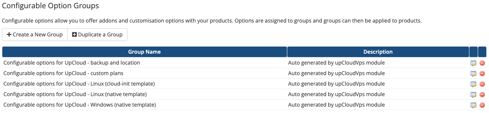

# UpCloud WHMCS Module Installation Guide

This guide will walk you through the process of installing and configuring the UpCloud VPS Module for WHMCS.

## Table of Contents

- [Overview](#overview)
- [Features](#features)
- [Installation](#installation)
  - [Downloading and Uploading to WHMCS](#downloading-and-uploading-to-whmcs)
  - [Obtaining API Credentials](#obtaining-api-credentials)
  - [Creating Your First WHMCS Server](#creating-your-first-whmcs-server)
  - [Creating a Server Group](#creating-a-server-group)
- [Configuration](#configuration)
  - [Creating a Product Group](#creating-a-product-group)
  - [Creating a New Product](#creating-a-new-product)
  - [Module Settings](#module-settings)
  - [Configurable Options](#configurable-options)
- [Adding Existing VPS to Users](#adding-existing-vps-to-users)

## Overview

The UpCloud VPS Module for WHMCS is a versatile tool designed to assist businesses of all sizes in efficiently managing their Cloud Instances. It simplifies the process of configuring and overseeing VM instances, providing users with seamless control and automation capabilities.

## Features

### Admin Features:

1. **Deployment**: Administrators can manually deploy VMs by clicking 'Create' or set up automatic deployment during product setup, specifying location, region, OS, and custom fields like SSH keys or user data (cloud-init) initialization.

2. **Termination**: VM termination can be done manually or automated, with the option to set up automatic termination through WHMCS automation settings, which functions based on WHMCS cron jobs.

3. **Upgrade/Downgrade**: Administrators can manually adjust CPU/RAM/Storage configurations by clicking the 'Change Package' button, or configure automatic upgrades/downgrades.

4. **VM Management**: Administrators can start, stop, restart, suspend, unsuspend VMs, and view all basic VM information including VPS, VNC, IP addresses, etc.

5. **Reverse PTR**: Admins can set and view reverse PTR records.

6. **Login Credentials**: If configured, the system can even send login credentials automatically.

7. **Custom Plans**: Once set by admin during product setup, users can customize their plans and select them for deployment after making a payment.

8. **Cron Job**: The administrator must schedule cron jobs to run every 5 minutes to generate bandwidth usage graphs.

9. **Pricing Adjustment**: While UpCloud has predefined prices for Windows, CPU, RAM, and storage, you have the flexibility to adjust them according to your specific requirements.

### Client Features:

1. **VM Information**: Clients can view basic VM information such as VPS, VNC, IP addresses details.

2. **VNC Management**: Clients can enable/disable VNC access.

3. **Password Management**: Clients can change their VNC passwords.

4. **Reverse PTR**: Clients can view and set reverse PTR records.

5. **VM Control**: Clients can start, stop, and restart their VMs.

6. **Configuration Modification**: Clients can modify server configurations to suit their needs.

7. **Bandwidth Usage Graph**: Clients can view bandwidth usage graphs for intervals spanning 24 hours, a week, a month, and a year.

## Installation

### Downloading and Uploading to WHMCS

1. Obtain the module from our GitHub repository.
2. Unpack the module on your local system and transfer the "upCloudVps" folder to your WHMCS directory named "/path-to-your-WHMCS/modules/servers/" on your WHMCS installation.

### Obtaining API Credentials

1. Access the UpCloud Hub at  https://hub.upcloud.com and log in using your credentials.
2. Navigate to the "People" section from the left sidebar.
3. Proceed to create a sub-account by selecting the "Create subaccount" button.
4. Enter a username, password, and complete other required details (Personal Information), then click "Create subaccount" at the bottom.
5. After creating the user, click on "Edit", then navigate to the Permissions section and click on "Go to permissions".
6. Enable all permissions except "Control Panel" and save the changes.

### Creating Your First WHMCS Server

Reference: https://docs.whmcs.com/Servers

1. Log in to your WHMCS as an admin user and go to Configuration > System Settings > Servers.
2. Select "Add New Server" and choose "UpCloud VPS" from the module dropdown.
3. Enter the Hostname or IP Address as: api.upcloud.com (you can assign any name).
4. For Username, input your API username created in the previous step.
5. For Password, input your API password created in the previous step.
6. Proceed by clicking on "Test Connection" or "Continue Anyway".

### Creating a Server Group

1. Click Create New Group under the Options heading.
2. Enter a name for your group.
3. Select the servers you want to assign (previously created) to this group in the box on the left.
4. Click Add to move them to the box on the right, which contains the servers for this group.
5. Click Save Changes to complete the process.

## Configuration

### Creating a Product Group

1. Navigate to Configuration > System Settings > Product/Services

2. Click on Create Product Group

3. Provide a Product Group name and adjust all other settings based on your requirements

4. Click on Save Changes

### Creating a New Product

1. Click on Create a New Product

2. Configure the following details:
   - **Product Type**: Select as "Other"
   - **Product Group**: Select the product group that you created
   - **Product Name**: Provide your product name
   - **Module**: UpCloud VPS
   - **Create as Hidden**: Off
3. Click on Save Changes

### Module Settings

On the next page:
1. Verify the Product Type
2. Set Welcome Email to "Dedicated/VPS Server Welcome Email"
3. Go to the Module Settings Tab
4. Select the required details:
   - Module Name
   - Server group
   - Default Location
   - Plan
   - Template
5. If for Plans you selected "Custom", then users will have the ability to choose their own CPU, RAM, and Storage space based on which VMs will be created.

6. Decide whether the product requires manual approval from admins or is automatically deployed upon order.
7. Click the Save Changes button.

This will create custom fields named (`instanceId`, `ssh_key` & `userData`) as shown below:

### Configurable Options

The module will automatically create Configurable Options when you create your first product. You can select option groups that apply to your product.

To adjust these options:

1. Go to System Settings -> Configurable Options
2. Edit the newly created Options

Through these configurations you can:

- Set custom pricing for backup options
- Configure available locations
- Configure available custom plans
- Adjust prices for available images (such as Windows)
- Backup and Location: set custom pricing for backup options, and configure available locations

If custom plans are utilised:

- **Memory**: Users can choose the memory of a VPS, ranging from 4GB to 64GB.
- **vCPU**: Users can choose the vCPU of a VPS, ranging from 2 cores to 24 cores.
- **Storage**: Users can choose the storage of a VPS, ranging from 50GB to 460GB.

Note that custom plans are a discontinued feature. See the [UpCloud product documentation](https://upcloud.com/docs/products/cloud-servers/pricing/flexible-plans/) for more information.

## Adding Existing VPS to Users

To add an existing UpCloud VPS to a user's account:
1. Edit the user's product
2. Within the custom field named "Instance Id", add your VPS UUID that you can obtain from UpCloud Hub

## Additional Configuration

### Product/Service -> Custom Fields

- **User Data/Cloud-init**: If provided by the user, these scripts will initiate after VM creation to kickstart the initialization process.
- **SSH Key**: If supplied by the user during VM creation, it will be utilized for user authentication instead of a password; otherwise, the system will default to using a password for authentication. Note that some templates only support SSH keys.
- **Instance Id**: This field is used to assign a user with a VPS

## Cron Job Setup

The administrator must schedule cron jobs to run every 5 minutes to generate bandwidth usage graphs. This is essential for the bandwidth monitoring feature to work properly.

